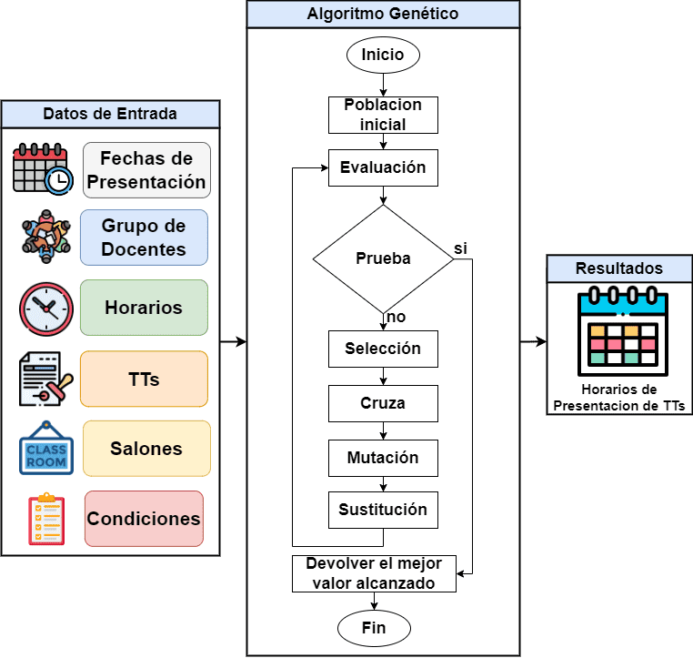

# CATT
---
## Descripcion

La Escuela Superior de Cómputo del Instituto Politécnico Nacional tiene una problematica en el area encargada de todo el proceso de titulacion, esta area es llamada Comisión Academica de Trabajos Terminales (CATT). Dicha problematica se presenta en el proceso de generacion de horarios de presentacion de trabajos terminales (tesis) donde el tiempo para generar dicho horario es muy tardado ya que todos los horarios se registran en un archivo excel de uno en uno. Esto funciono por años, pero con el aumento de matricula de estudiantes este proceso se ha hecho tedioso y dificil.
  
El problema recae en que a mayor numero de estudiantes que presentaran trabajo terminal sera mayor el numero de combinaciones entre horarios de docentes, horario, fecha y salon de presentacion que el administrativo de la CATT tendra que machear, incluso dificultandose mas cuando un trabajo terminal tiene 2 directores.
  

---
## Solucion 💡 

  Para abordar este problema se implemento un <strong>Algoritmo Genetico</strong> para generar todas posibles poblaciones y obtener la mejor la mejor solucion posible.   

### Diagrama del Algoritmo Genetico

  

### Vista Teorica del Cromosoma

  

### Donde:
  
- Fechas de Presentacion: Es un rango de fechas ingresado por el usuario administrador.
- Grupo de Docentes: Cada trabajo terminal (TT) tiene un grupo de docentes compuesto por 1 o 2 directores y 3 sinodales.
- Horarios: Listra de horarios ingresados por el administrador.
- TTs: Lista de trabajos terminales ingresados en el ciclo escolar.
- Salones: Lista de salones que se utilizaran para las presentaciones.
- Condiciones: Conjunto de reglas que un individuo debe de cumplir para que se considere optimo, son las siguientes.  
 1 - Condición Horario ptimo Presentacion (CHOP): Evaluacion entre el horario en el gen de cromosoma y el horario óptimo del objeto TT.  
 2 - Condicion Horario Docente (CHD): El grupo docente tendra un horario optimo general.  
 3 - Condicion Tipo TT (CTTT): Se separaran los trabajos terminales de acuerdo con el tipo (TT1, TT2 o TTR).  
 4 - Condiciones de Fechas de Presentacion (CFP): Las fechas de presentacion se dividen en TT1, TT2 y TTR.  
 5 - Condicion TT Repetido (CTTR): Un TT no se puede presentar dos veces en el mismo ciclo,  a menos que sea extra de TT.  
 6 - Condicion Docente Traslape (CDT): Un docente no podra estar en dos o mas presentaciones en el mismo horario.  
 7 - Dos TT no pueden agendarse en el mismo dia, horario y salon.  
 8 - La CATT brinda los salones, hoarios y fechas de presentacion a utilizar.  

## Resultados

  Una vez el algoritmo termina se devuelve el mejor resultado obtenido en donde se evitaron totalmente los traslapes o casi en su totalidad. Anteriormente la CATT tardaba 1 mes y medio en completar este proceso, con la     implementacion de este algoritmo se logro una efectividad arriba de 95% tardandose 60 segundos aproximadamente en completarse. En la siguiente tabla se pueden verificar los tiempos que se tardo el algoritmo con una lista de trabajos terminales de 105 y otra lista de 226; para cada lista el algoritmo se ejecuto 5 veces para asi ver que tanta variacion tiene en sus resultados, mostrando cuantos horarios de presentacion son optimos (sin traslape) y no optimos (con traslape).

### Tabla de Tiempos

  

   [NOTA] Consulta el articulo tecnico completo aqui <a href="https://drive.google.com/file/d/1vog1J9IT1pdFCHmlEFufoNcS4YD638O-/view?usp=sharing" target="_blank rel="noreferrer"" >
    Articulo</a>
  

